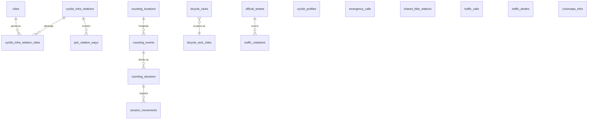
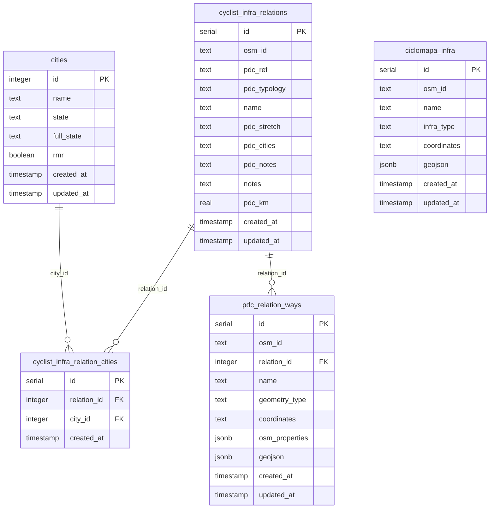
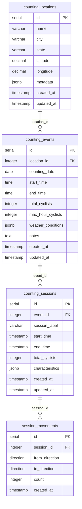
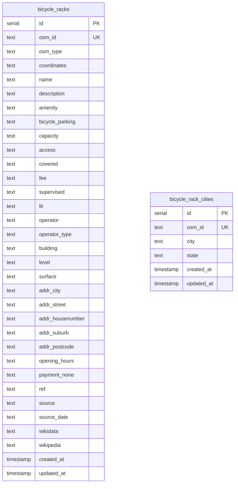
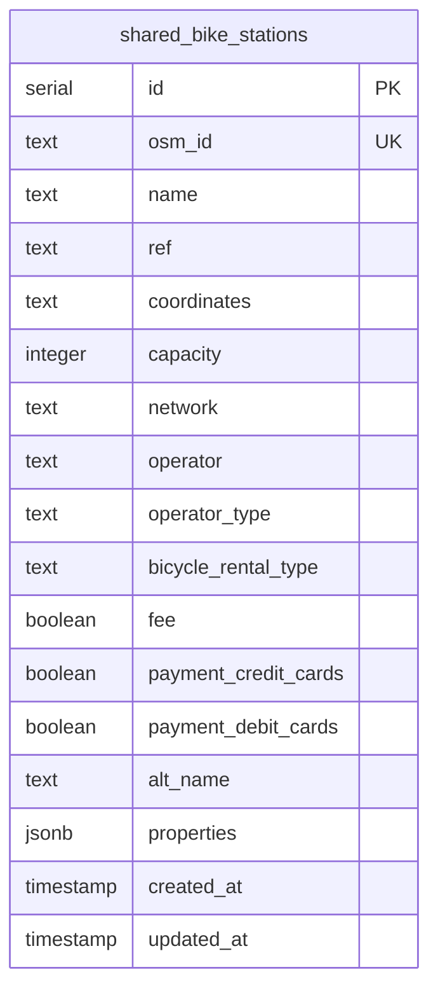
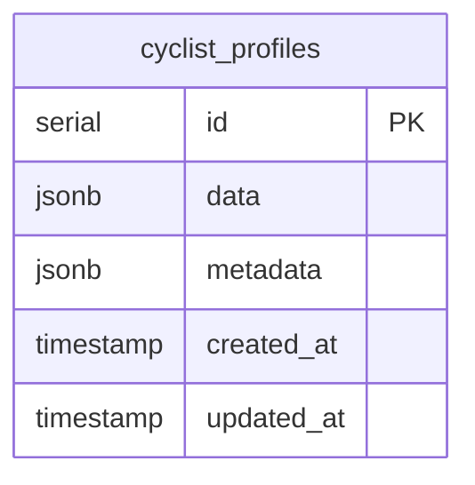
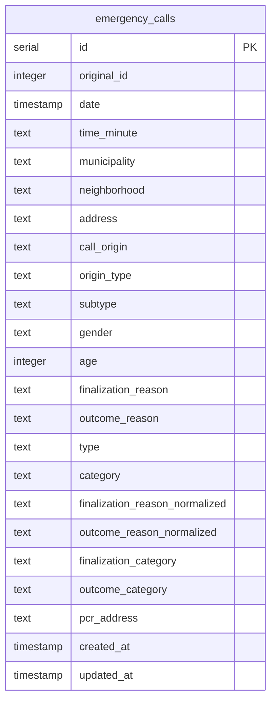
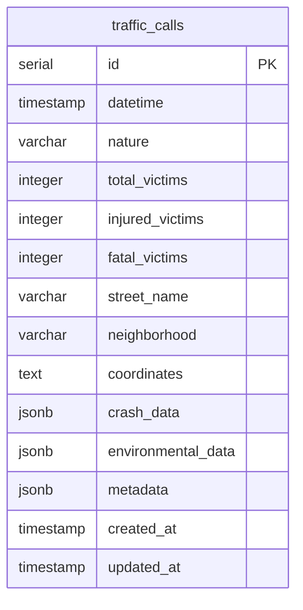
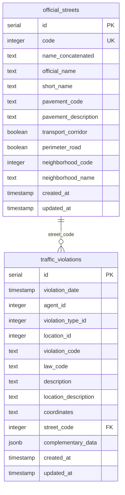

# Diagrama de Banco de Dados - Projeto Atlas

## Visão Geral

O projeto Atlas utiliza uma **arquitetura de banco único com schema público**, onde todos os serviços compartilham o mesmo banco PostgreSQL com extensão PostGIS para dados geoespaciais.

### Tecnologias
- **Banco de Dados**: PostgreSQL 15+ com PostGIS
- **ORM**: Drizzle ORM
- **Linguagem**: TypeScript
- **Migrações**: Drizzle Kit
- **Schema**: Público único (`public`)

## Estrutura Geral do Banco



## Módulos por Domínio

### 1. Infraestrutura Ciclística (`cycling-infra`)



### 2. Contagem de Ciclistas (`cyclist-counts`)



### 3. Estacionamentos de Bicicletas (`bicycle-racks`)



### 4. Bicicletas Compartilhadas (`shared-bike`)



### 5. Perfis de Ciclistas (`cyclist-profile`)



### 6. Chamadas de Emergência (`emergency-calls`)



### 7. Acidentes de Trânsito (`traffic-calls`)



### 8. Mortes no Trânsito (`traffic-deaths`)

```mermaid
erDiagram
    traffic_deaths {
        serial id PK
        integer contador
        varchar tipobito
        date dtobito
        varchar horaobito
        varchar natural
        integer codmunnatu
        date dtnasc
        integer idade
        varchar sexo
        varchar racacor
        varchar estciv
        varchar esc
        varchar esc2010
        varchar seriescfal
        varchar ocup
        integer codmunres
        varchar lococor
        varchar codestab
        text estabdescr
        integer codmunocor
        text linhaa
        text linhab
        text linhac
        text linhad
        text linhaii
        text causabas
        text causabas_o
        text cb_pre
        varchar circobito
        varchar acidtrab
        varchar fonte
        varchar origem
        varchar assistmed
        varchar exame
        varchar cirurgia
        varchar necropsia
        date dtinvestig
        date dtcadastro
        date dtrecebim
        varchar numerolote
        varchar tppos
        varchar atestante
        varchar stcodifica
        varchar codificado
        varchar versaosist
        varchar versaoscb
        integer data_year
        varchar import_batch
        timestamp created_at
        timestamp updated_at
    }
```



### 9. Infrações de Trânsito (`traffic-violations`)



## Enums e Tipos Especiais

### Direction Enum
```sql
CREATE TYPE "direction" AS ENUM('north', 'east', 'south', 'west');
```

## Índices Importantes

### Traffic Deaths
- `idx_dtobito` - Data do óbito
- `idx_codmunocor` - Código município ocorrência  
- `idx_codmunres` - Código município residência
- `idx_causabas` - Causa básica
- `idx_data_year` - Ano dos dados
- `idx_year_munocor` - Ano + município ocorrência

## Campos Geoespaciais

Várias tabelas possuem campo `coordinates` como `text` que será migrado para PostGIS:

### Conversão Planejada para PostGIS
- `bicycle_racks.coordinates` → `geometry(Point, 4326)`
- `shared_bike_stations.coordinates` → `geometry(Point, 4326)`
- `traffic_calls.coordinates` → `geometry(Point, 4326)`
- `traffic_violations.coordinates` → `geometry(Point, 4326)`
- `ciclomapa_infra.coordinates` → `geometry(LineString, 4326)`
- `pdc_relation_ways.coordinates` → `geometry` (tipo baseado em `geometry_type`)

## Relacionamentos Principais

### 1:N (Um para Muitos)
- `counting_locations` → `counting_events`
- `counting_events` → `counting_sessions`
- `counting_sessions` → `session_movements`
- `cyclist_infra_relations` → `pdc_relation_ways`
- `official_streets` → `traffic_violations`

### N:N (Muitos para Muitos)
- `cities` ↔ `cyclist_infra_relations` (via `cyclist_infra_relation_cities`)

## Dados JSONB Estruturados

### Cyclist Counts - Characteristics
```json
{
  "cargo": 0,
  "helmet": 0,
  "juveniles": 0,
  "motor": 0,
  "other_active_modes": 0,
  "other_behaviors": 0,
  "others": 0,
  "rain": 0,
  "ride": 0,
  "service": 0,
  "shared_bike": 0,
  "sidewalk": 0,
  "women": 0,
  "wrong_way": 0
}
```

### Traffic Calls - Crash Data
```json
{
  "type": "COLISÃO",
  "description": "...",
  "address": "...",
  "vehicles": {
    "cars": 0,
    "motorcycles": 0,
    "bicycles": 0,
    "cyclists": 0,
    "pedestrians": 0,
    "buses": 0,
    "trucks": 0,
    "police_vehicles": 0,
    "others": 0
  }
}
```

## Estratégia de Dados

### Banco Único, Schema Público
- **Vantagem**: Consultas cross-service diretas
- **Vantagem**: Migrações centralizadas
- **Vantagem**: Relacionamentos entre domínios
- **Desvantagem**: Acoplamento entre serviços

### Dados Flexíveis com JSONB
- Campos `metadata`, `properties`, `characteristics`
- Validação via Zod schemas
- Evolução de schema sem migrações

### Dados Geoespaciais
- Preparado para PostGIS
- Coordenadas em WGS84 (SRID 4326)
- Suporte a Point, LineString, MultiLineString

## Volume de Dados Estimado

- **traffic_deaths**: ~50k registros (dados DATASUS anuais)
- **traffic_violations**: ~100k+ registros
- **cyclist_counts**: Crescimento orgânico
- **bicycle_racks**: ~1k registros (dados OSM)
- **emergency_calls**: ~10k+ registros anuais

## Considerações de Performance

1. **Índices**: Criados para queries frequentes (datas, localização)
2. **JSONB**: Permite índices GIN para consultas em campos flexíveis
3. **PostGIS**: Índices espaciais para consultas geográficas
4. **Particionamento**: Considerado para `traffic_deaths` por ano
5. **Materialized Views**: Para agregações complexas