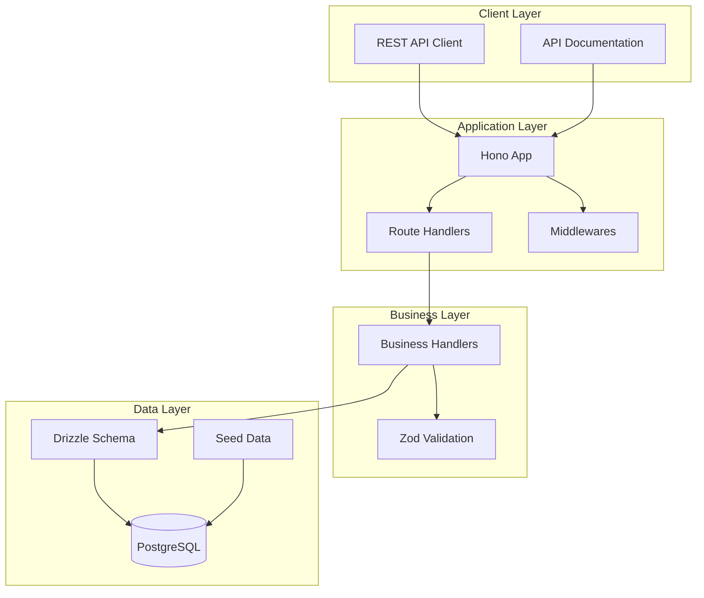
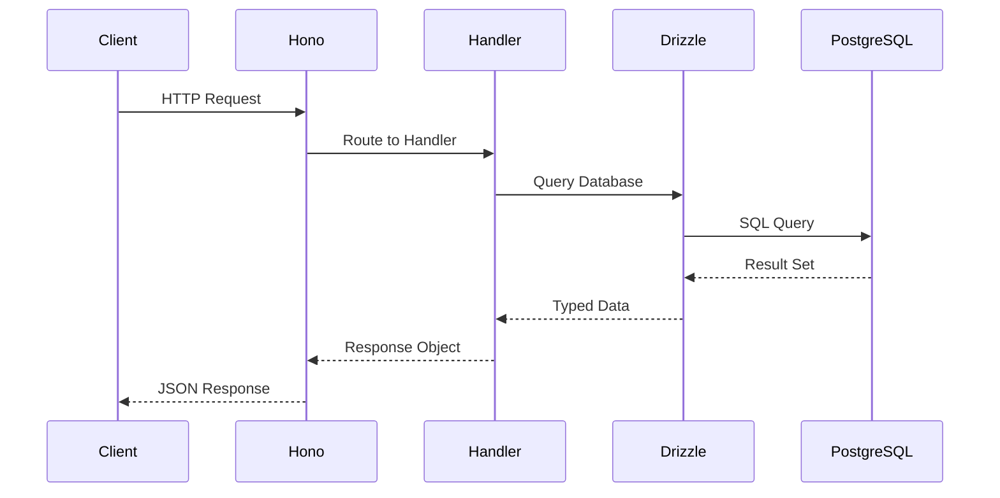
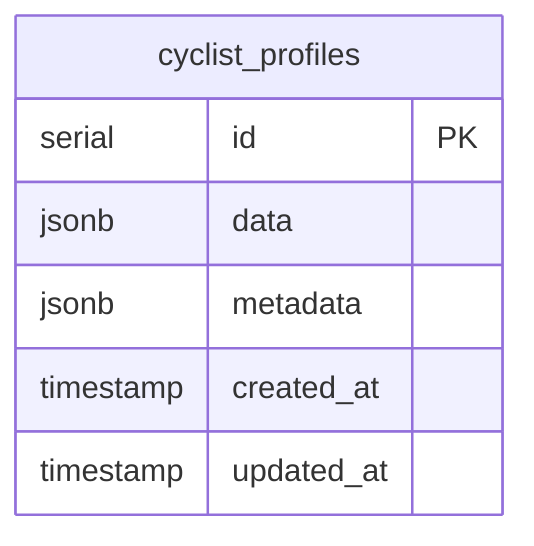
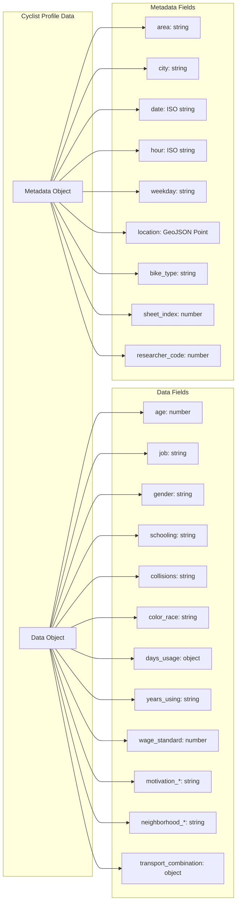
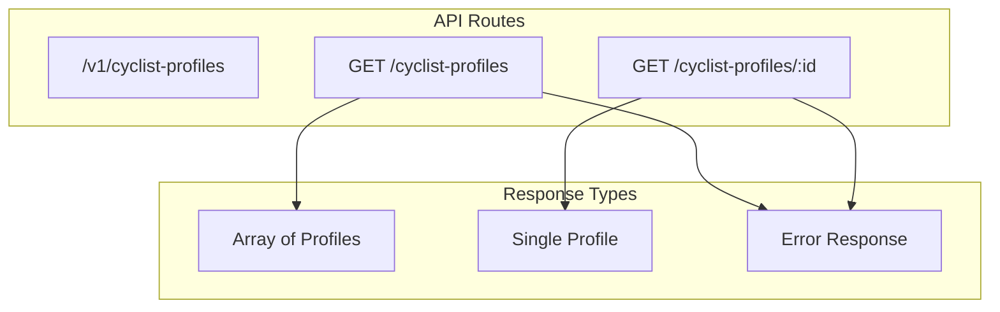
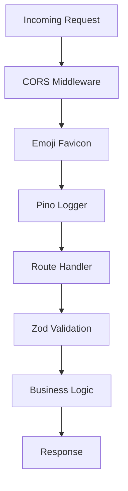
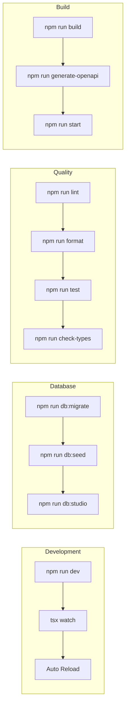
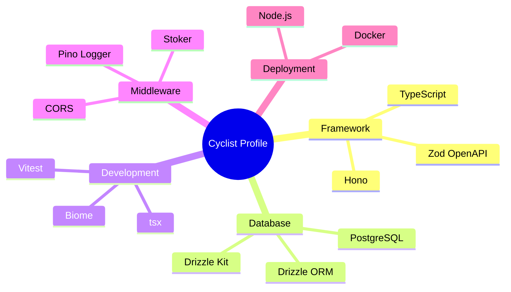
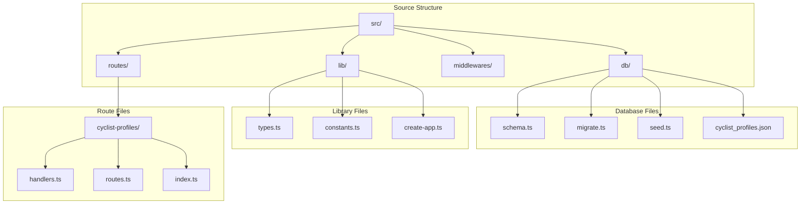

# Cyclist Profile Service - Architecture Overview

## System Architecture

## Data Flow

## Database Schema

## Data Structure

## API Endpoints

## Middleware Stack

## Development Workflow

## Technology Stack

## File Structure

## Key Features

- **Type Safety**: Full TypeScript support with Zod validation
- **OpenAPI**: Automatic API documentation generation
- **Database**: PostgreSQL with Drizzle ORM for type-safe queries
- **Logging**: Structured logging with Pino
- **Testing**: Vitest for unit and integration tests
- **Development**: Hot reload with tsx watch
- **Code Quality**: Biome for linting and formatting
- **Containerization**: Docker support for deployment

## Data Model Insights

The cyclist profile service manages comprehensive cyclist survey data with:

- **Personal Information**: Age, gender, race, education, occupation
- **Cycling Behavior**: Usage patterns, experience, motivations
- **Geographic Data**: Neighborhoods, routes, locations with GeoJSON coordinates
- **Survey Metadata**: Collection context, researcher info, temporal data
- **Infrastructure Needs**: Identified gaps and improvement suggestions

This architecture supports efficient querying and analysis of cyclist demographics and behavior patterns for urban planning and infrastructure development.