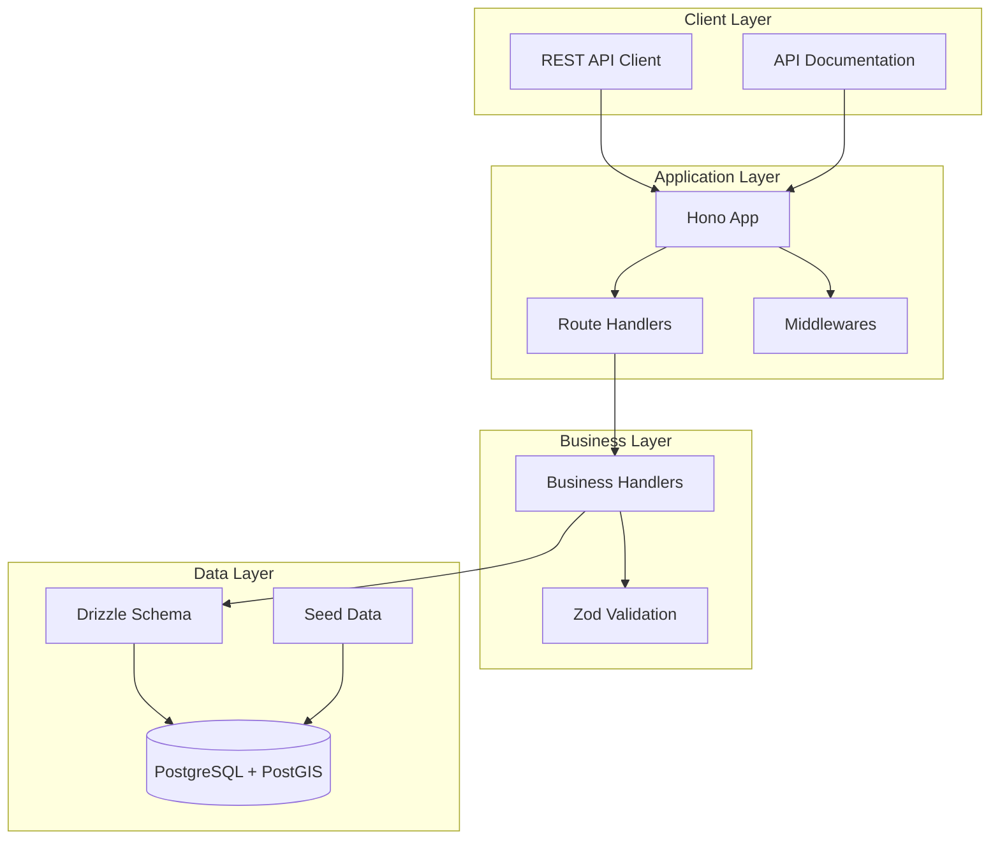
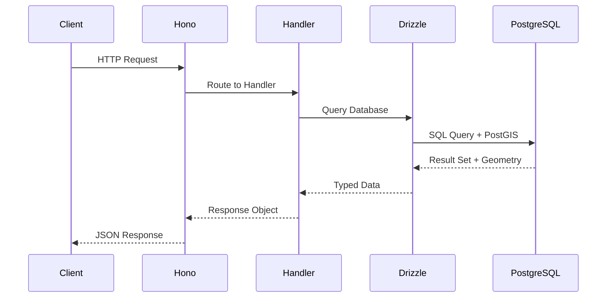
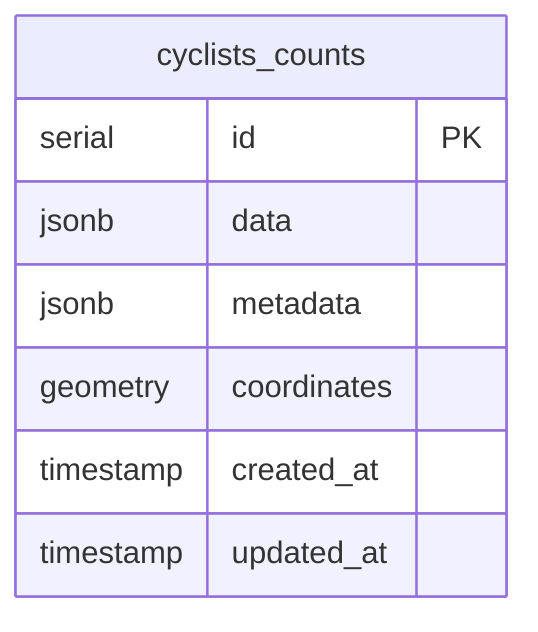
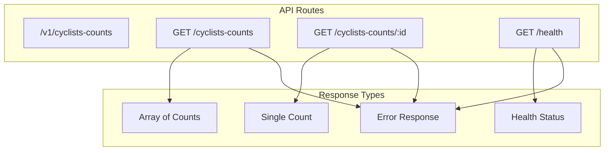
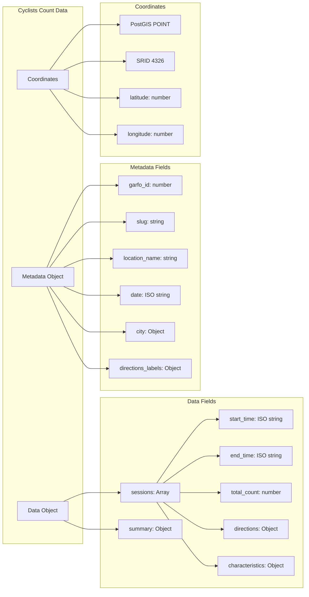
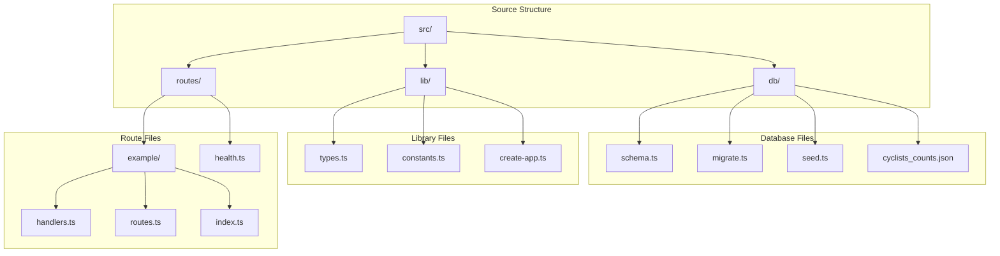
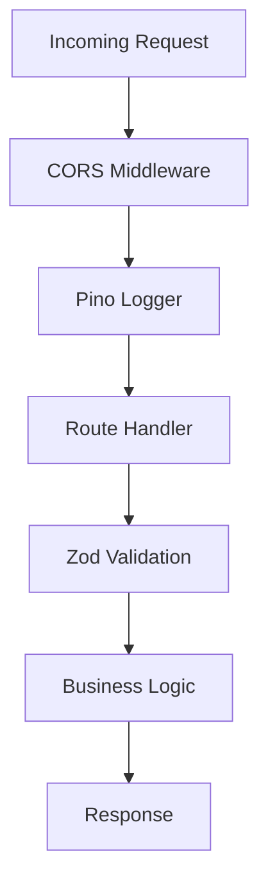
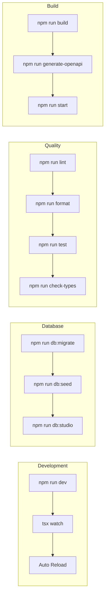
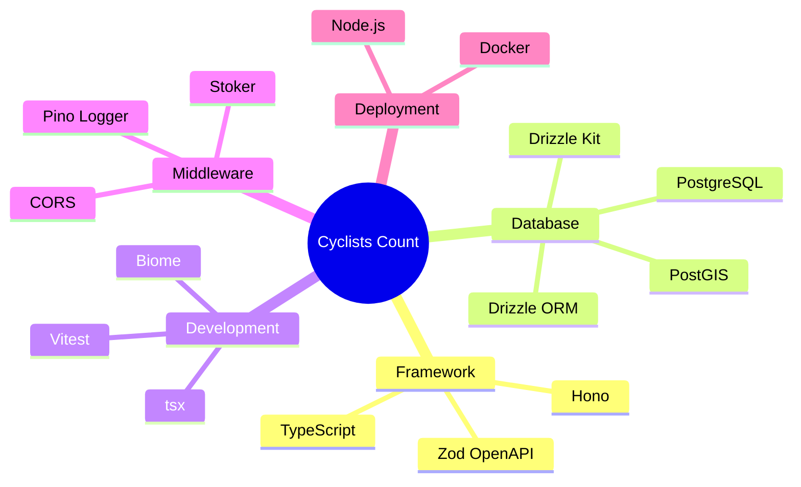

# Cyclists Count Service - Architecture Overview

## System Architecture

## Data Flow

## Database Schema

## API Endpoints

## Data Structure

## File Structure

## Middleware Stack

## Development Workflow

## Technology Stack

## Key Features

- **Type Safety**: Full TypeScript support with Zod validation
- **OpenAPI**: Automatic API documentation generation
- **PostGIS**: Spatial database support for geographic queries
- **Database**: PostgreSQL with Drizzle ORM for type-safe queries
- **Logging**: Structured logging with Pino
- **Testing**: Vitest for unit and integration tests
- **Development**: Hot reload with tsx watch
- **Code Quality**: Biome for linting and formatting
- **Containerization**: Docker support for deployment

## Data Model Insights

The cyclists count service manages comprehensive cycling count data with:

- **Count Sessions**: Time-based counting intervals with directional data
- **Geographic Data**: PostGIS points for precise location mapping
- **Directional Analysis**: North/South/East/West movement patterns
- **Cyclist Characteristics**: Demographics like gender, helmet usage, cargo
- **Temporal Data**: Date/time patterns for traffic analysis
- **Research Metadata**: Survey context, location names, city information

This architecture supports efficient spatial queries and temporal analysis of cycling patterns for urban planning and infrastructure development.

