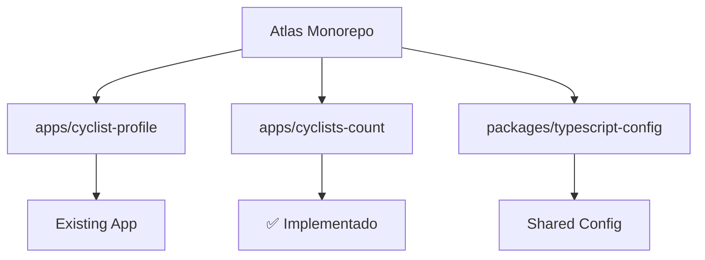
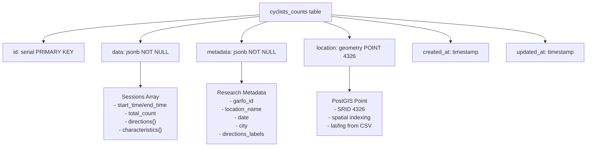
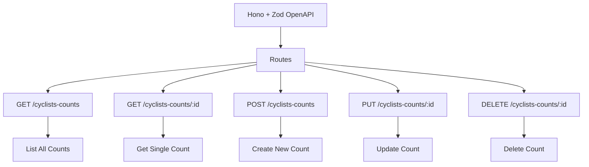
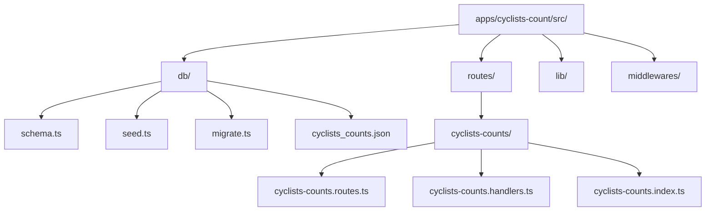
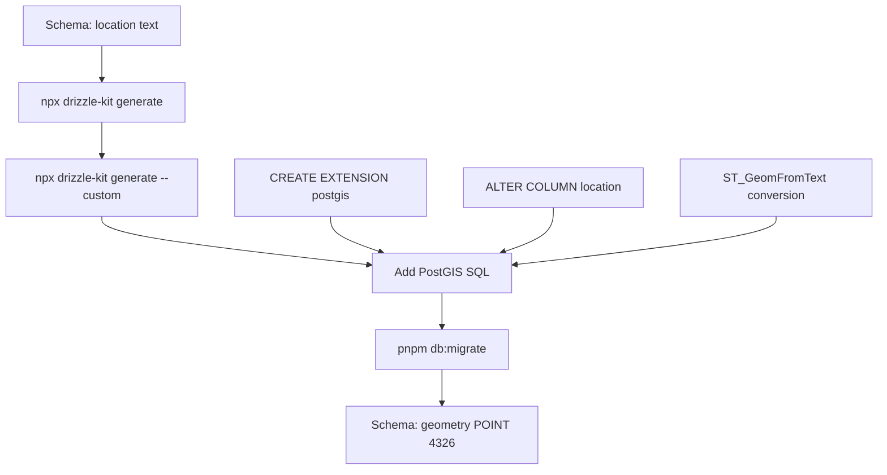
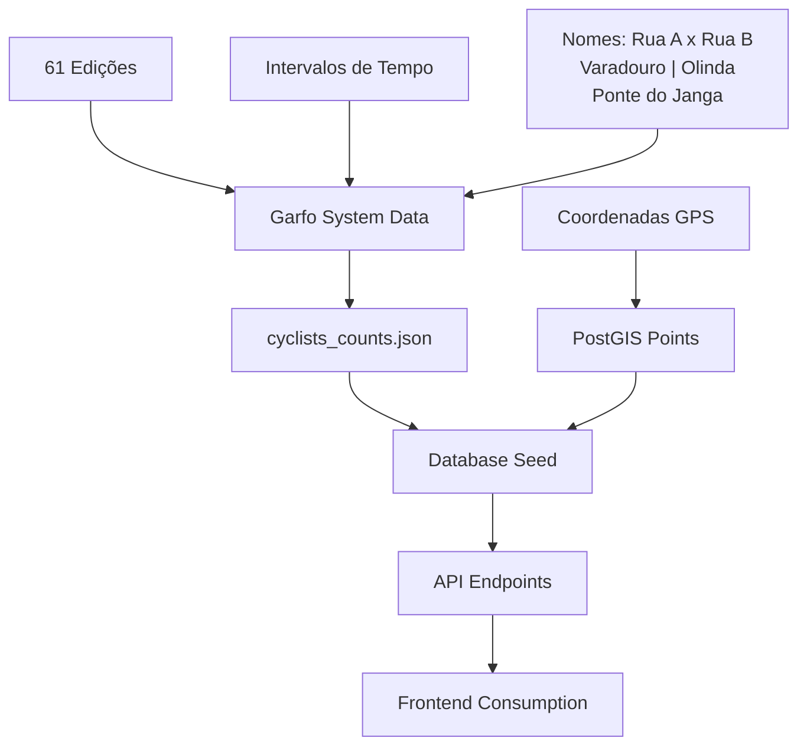

# Arquitetura do App Cyclists-Count

## Diagrama da Estrutura e Implementação

### Estrutura do Monorepo


### Schema da Base de Dados


### Estrutura da API


### Estrutura do App


### Fluxo de Migração PostGIS


### Fluxo de Dados


## Estrutura da Base de Dados

A base `cyclists-count` seguirá o mesmo padrão do `cyclist-profile`:

### Tabela Principal: `cyclists_counts`
- **id**: Chave primária serial
- **data**: JSONB contendo dados das contagens (intervalos, direções, características)
- **metadata**: JSONB contendo metadados (nome do local, data, pesquisador, anotações)
- **location**: PostGIS POINT para coordenadas geográficas
- **created_at/updated_at**: Timestamps de controle

### Estrutura dos Dados JSONB

**data** (múltiplas sessões por edição):
```json
{
  "sessions": [
    {
      "start_time": "2013-03-25T09:00:00.000Z",
      "end_time": "2013-03-25T10:00:00.000Z",
      "total_count": 143,
      "directions": {
        "north_west": 0,
        "north_south": 52,
        "east_west": 5,
        "west_east": 47
      },
      "characteristics": {
        "cargo": 11,
        "helmet": 3,
        "women": 16,
        "wrong_way": 11
      }
    }
  ],
  "summary": {
    "max_hour": 222,
    "total_cyclists": 1431,
    "total_women": 76
  }
}
```

**metadata**:
```json
{
  "garfo_id": 1,
  "slug": "1-2013-03-25-av-rui-barbosa-x-r-amelia",
  "location_name": "Av. Rui Barbosa x R. Amélia",
  "date": "2013-03-25",
  "city": {
    "id": 2611606,
    "name": "Recife",
    "state": "PE"
  },
  "directions_labels": {
    "north": "Parnamirim",
    "east": "Espinheiro",
    "south": "Centro",
    "west": "Torre"
  }
}
```

**location** (PostGIS POINT):
```sql
ST_SetSRID(ST_MakePoint(-34.8851, -8.1137), 4326)
```

## API Implementation

### Endpoints:
- `GET /cyclists-counts` - Listar todas as contagens
- `GET /cyclists-counts/:id` - Obter contagem específica
- `POST /cyclists-counts` - Criar nova contagem
- `PUT /cyclists-counts/:id` - Atualizar contagem
- `DELETE /cyclists-counts/:id` - Deletar contagem

### Tecnologias:
- **Framework**: Hono + Zod OpenAPI
- **Database**: PostgreSQL + Drizzle ORM
- **Validation**: Zod schemas
- **Documentation**: Scalar API Reference

## Dados Originais do Garfo

Os dados incluem:
- **61 edições** de contagem (2013-2023)
- **848 sessões** de contagem (intervalos de 1 hora)
- **Coordenadas geográficas** de todos os pontos (CSV)
- **Nomes das direções** (norte, sul, leste, oeste) por local
- **Características dos ciclistas** (capacete, gênero, carga, etc.)
- **Direções de movimento** (norte-sul, leste-oeste, etc.)

## Migração PostGIS

### Fluxo de Migração:
1. **Schema inicial**: `location: text` (temporário)
2. **Migração base**: `npx drizzle-kit generate`
3. **Migração custom**: `npx drizzle-kit generate --custom`
4. **SQL customizado**:
   ```sql
   CREATE EXTENSION IF NOT EXISTS postgis;
   ALTER TABLE cyclists_counts 
     ALTER COLUMN location 
       TYPE geometry(POINT, 4326) 
     USING ST_GeomFromText(location, 4326);
   ```

## Status da Implementação

- ✅ **Estrutura do app** criada
- ✅ **Schema** definido com PostGIS
- ✅ **Dados baixados** da API Garfo (61 edições)
- ✅ **Coordenadas** integradas do CSV
- ✅ **Rotas da API** implementadas
- ✅ **Migrações** configuradas
- 🔄 **PostGIS** em configuração
- ⏳ **Seed** pendente
- ⏳ **Docker** pendente
- ⏳ **CI/CD** pendente