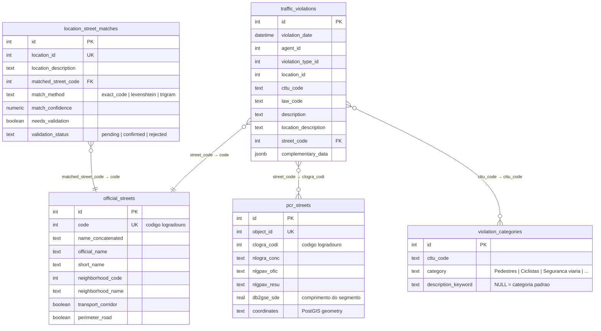

# Traffic Violations — Banco de Dados & API

## Diagrama do Banco (ER)



---

## Relacionamentos entre tabelas

| Origem | FK | Destino | PK | Notas |
|--------|----|---------|-----|-------|
| `traffic_violations.street_code` | integer | `official_streets.code` | integer | 1 rua tem N infrações |
| `pcr_streets.clogra_codi` | integer | `official_streets.code` | integer | 1 rua tem N segmentos geográficos |
| `traffic_violations.cttu_code` | text | `violation_categories.cttu_code` | text | 1 código pode ter N categorias (1 default + N por keyword) |
| `location_street_matches.matched_street_code` | integer | `official_streets.code` | integer | resultado do pipeline de matching |

---

## API × Tabelas

```mermaid
graph TB
    subgraph "Dashboard /dashboard/*"
        D_O["overview<br/>TV + OS"]
        D_TV["top-violations<br/>TV<br/>🔴 sem category"]
        D_TS["top-streets<br/>TV + OS + PCR<br/>🔴 top_violation sem category"]
        D_T["temporal<br/>TV"]
        D_AA["agent-analysis<br/>TV<br/>🔴 top_violations sem category"]
        D_VC["violation-codes<br/>TV + VC ✅"]
        D_C["categories<br/>VC"]
    end

    subgraph "Streets /streets/*"
        S_L["list<br/>OS"]
        S_G["{code}<br/>OS"]
        S_R["ranking<br/>TV + OS + PCR"]
        S_SUM["{code}/summary<br/>TV + OS"]
        S_SV["{code}/violations<br/>TV"]
        S_N["neighborhoods<br/>TV + OS"]
        S_GJ["geojson<br/>TV + OS + PCR<br/>✅ corrigido"]
    end

    subgraph "Matching /streets/match/*"
        M_M["match<br/>LSM"]
        M_B["batch<br/>LSM"]
        M_S["stats<br/>LSM"]
    end

    subgraph "Validation /streets/validations/*"
        V_L["pending<br/>LSM"]
        V_C["{id}/confirm<br/>LSM"]
        V_R["{id}/reject<br/>LSM"]
    end

    subgraph "Violations /violations/*"
        VL_L["list<br/>TV"]
        VL_G["{id}<br/>TV"]
        VL_BL["by-location<br/>TV"]
    end

    subgraph "Summary /violations/summary/*"
        VS_S["summary<br/>TV"]
        VS_T["by-type<br/>TV"]
        VS_A["by-agent<br/>TV"]
        VS_TA["temporal<br/>TV"]
    end

    subgraph "Tabelas"
        TV[("traffic_violations")]
        OS[("official_streets")]
        PCR[("pcr_streets")]
        VC[("violation_categories")]
        LSM[("location_street_matches")]
    end

    D_O --> TV & OS
    D_TV --> TV
    D_TS --> TV & OS & PCR
    D_T --> TV
    D_AA --> TV
    D_VC --> TV & VC
    D_C --> VC

    S_L & S_G --> OS
    S_R --> TV & OS & PCR
    S_SUM & S_SV --> TV & OS
    S_N --> TV & OS
    S_GJ --> TV & OS & PCR

    M_M & M_B & M_S --> LSM
    V_L & V_C & V_R --> LSM

    VL_L & VL_G & VL_BL --> TV

    VS_S & VS_T & VS_A & VS_TA --> TV
```



---

## Lista completa de endpoints

### Dashboard

| Método | Path | Tabelas | Filtros data | Tem `category`? |
|--------|------|---------|-------------|-----------------|
| GET | `/dashboard/overview` | TV + OS | — | — |
| GET | `/dashboard/top-violations` | TV | start_date, end_date | 🔴 não |
| GET | `/dashboard/top-streets` | TV + OS + PCR | start_date, end_date | 🔴 não (top_violation) |
| GET | `/dashboard/temporal` | TV | start_date, end_date | — |
| GET | `/dashboard/agent-analysis` | TV | start_date, end_date | 🔴 não (top_violations) |
| GET | `/dashboard/violation-codes` | TV + VC ✅ | — | ✅ sim |
| GET | `/dashboard/categories` | VC | — | ✅ sim |

### Streets

| Método | Path | Tabelas | Filtros data |
|--------|------|---------|-------------|
| GET | `/streets` | OS | — |
| GET | `/streets/{code}` | OS | — |
| GET | `/streets/ranking` | TV + OS + PCR | start_date, end_date |
| GET | `/streets/{code}/summary` | TV + OS | — |
| GET | `/streets/{code}/violations` | TV | start_date, end_date |
| GET | `/streets/neighborhoods` | TV + OS | start_date, end_date |
| GET | `/streets/geojson` | TV + OS + PCR ✅ | start_date, end_date |

### Matching

| Método | Path | Tabelas |
|--------|------|---------|
| POST | `/streets/match` | LSM |
| POST | `/streets/match/batch` | LSM |
| GET | `/streets/match/stats` | LSM |

### Validation

| Método | Path | Tabelas |
|--------|------|---------|
| GET | `/streets/validations/pending` | LSM |
| POST | `/streets/validations/{id}/confirm` | LSM |
| POST | `/streets/validations/{id}/reject` | LSM |

### Violations

| Método | Path | Tabelas | Filtros data |
|--------|------|---------|-------------|
| GET | `/violations` | TV | month + year (obrigatórios) |
| GET | `/violations/{id}` | TV | — |
| GET | `/violations/by-location` | TV | month + year |

### Summary

| Método | Path | Tabelas |
|--------|------|---------|
| GET | `/violations/summary` | TV |
| GET | `/violations/summary/by-type` | TV |
| GET | `/violations/summary/by-agent` | TV |
| GET | `/violations/summary/temporal` | TV |

---

## Como funciona `violation_categories`

```
cttu_code = "5452", description_keyword = NULL,        category = "Estacionamento/uso da via"  ← padrão
cttu_code = "5452", description_keyword = "pedestre",  category = "Pedestres"                   ← override
cttu_code = "5452", description_keyword = "ciclovia",  category = "Ciclistas"                    ← override
cttu_code = "5452", description_keyword = "gramados",  category = "Estacionamento/uso da via"    ← override
```

**Regra**: O JOIN nos endpoints usa `description_keyword IS NULL` para pegar a categoria **padrão** de cada código. As linhas com keyword específica são usadas apenas pelo seed script para classificação fina de descrições.

**Dinâmico**: Atualizou a tabela `violation_categories` → todos os endpoints que fazem JOIN refletem automaticamente.

---

## Legenda

| Símbolo | Significado |
|---------|-------------|
| TV | `traffic_violations` |
| OS | `official_streets` |
| PCR | `pcr_streets` |
| VC | `violation_categories` |
| LSM | `location_street_matches` |
| ✅ | corrigido |
| 🔴 | pendente (falta JOIN com VC) |
