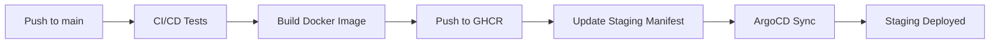
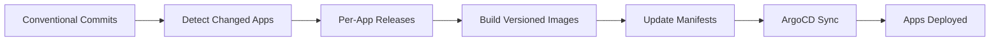
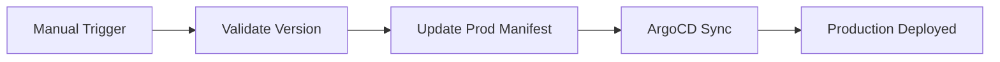

# GitOps Deployment Guide

This document explains how Atlas applications are automatically deployed using GitOps principles with ArgoCD and per-app semantic versioning.

## Overview

The deployment follows a GitOps approach where:
1. **Atlas Repository**: Contains the application code and CI/CD workflows
2. **Groundwork Repository**: Contains Kubernetes manifests and serves as the "source of truth"
3. **ArgoCD**: Monitors the groundwork repository and automatically deploys changes
4. **Per-App Versioning**: Each app (docs, cyclist-profile, etc.) has independent semantic versioning

## Workflow

### Automatic Staging Deployment



**Triggers**: Every push to `main` branch
**Target**: `docs-staging.ameciclo.org`
**Image Tag**: `latest`

### Release-based Production Deployment



**Triggers**: Conventional commits affecting specific apps
**Target**: Per-app production endpoints
**Image Tag**: Per-app semantic version (e.g., `docs:1.2.3`, `cyclist-profile:2.1.0`)

### Manual Production Deployment



**Triggers**: Manual workflow dispatch
**Target**: `docs.ameciclo.org`
**Image Tag**: User-specified version

## Per-App Versioning

Each Atlas application has independent semantic versioning:

| App | Current Version | Production URL | Staging URL |
|-----|----------------|----------------|-------------|
| **docs** | `0.0.1` | `docs.ameciclo.org` | `docs-staging.ameciclo.org` |
| **cyclist-profile** | `1.0.0` | `api.ameciclo.org/cyclist-profile` | `api-staging.ameciclo.org/cyclist-profile` |
| **cyclist-counts** | `1.0.0` | `api.ameciclo.org/cyclist-counts` | `api-staging.ameciclo.org/cyclist-counts` |
| **traffic-deaths** | `0.1.0` | `api.ameciclo.org/traffic-deaths` | `api-staging.ameciclo.org/traffic-deaths` |

### Version Management
- **Independent releases**: Each app can be released independently
- **Conventional commits**: Use app-specific commit prefixes (e.g., `feat(docs): add new page`)
- **Automatic detection**: CI/CD detects which apps changed and only releases those
- **Docker tags**: Each app gets its own semantic version tag

## Deployment Environments

### Staging Environment
- **Namespace**: `atlas-staging`
- **Auto-deploy**: ✅ Every main branch build (affected apps only)
- **Image Tags**: `latest` for all apps

### Production Environment
- **Namespace**: `atlas-production`
- **Auto-deploy**: ✅ On per-app semantic releases
- **Manual deploy**: ✅ Via GitHub Actions (per app)
- **Image Tags**: Semantic versions (e.g., `docs:1.2.3`, `cyclist-profile:2.1.0`)

## How to Deploy

### Staging (Automatic)
1. Push changes to `main` branch
2. CI/CD will automatically build and deploy to staging
3. Check `docs-staging.ameciclo.org`

### Production (via Release)
1. Use conventional commits (e.g., `feat: add new feature`)
2. Push to `main` branch
3. Release Please will create a release PR
4. Merge the release PR
5. Production will be automatically updated

### Production (Manual)
1. Go to GitHub Actions → "Deploy to Production"
2. Click "Run workflow"
3. Enter the version to deploy (e.g., `1.2.3`)
4. Type `DEPLOY` to confirm
5. Click "Run workflow"

## Monitoring

### ArgoCD Dashboard
- Monitor application health and sync status
- View deployment history
- Manual sync if needed

### Deployment Logs
Check the deployment log in the groundwork repository:
- File: `.github/deployment-log.md`
- Contains timestamped deployment history

### Application Logs
```bash
# Staging
kubectl logs -n atlas-staging -l app.kubernetes.io/name=atlas-docs

# Production
kubectl logs -n atlas-production -l app.kubernetes.io/name=atlas-docs
```

## Rollback

### Via ArgoCD UI
1. Open ArgoCD dashboard
2. Select the application
3. Go to "History and Rollback"
4. Select previous version and rollback

### Via Manual Deployment
1. Use "Deploy to Production" workflow
2. Specify the previous working version
3. Confirm deployment

## Troubleshooting

### Deployment Stuck
- Check ArgoCD application status
- Verify image exists in GHCR
- Check Kubernetes events: `kubectl get events -n atlas-[staging|production]`

### Image Not Found
- Ensure the version was properly released
- Check GHCR: `https://github.com/ameciclo/atlas/pkgs/container/atlas%2Fdocs`
- Verify CI/CD completed successfully

### ArgoCD Not Syncing
- Check ArgoCD application configuration
- Verify repository access
- Manual sync via ArgoCD UI
